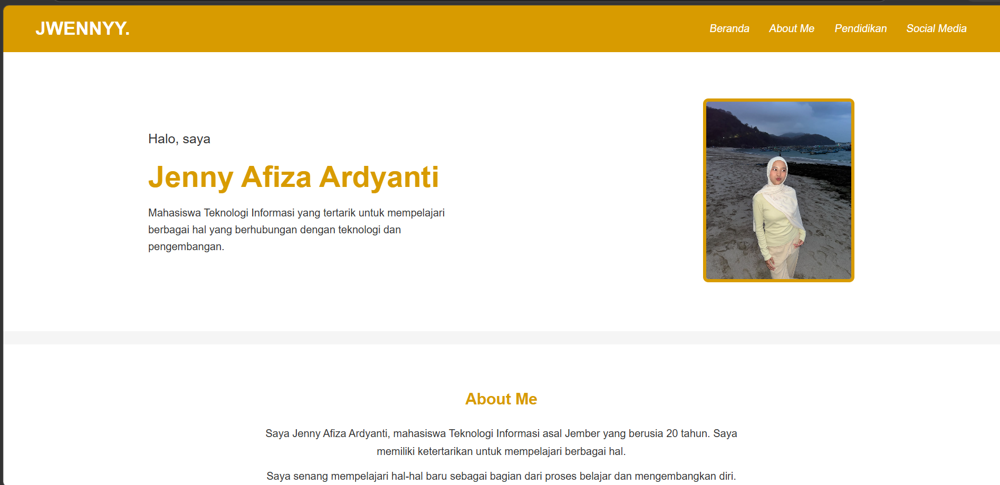

# Portofolio Website - Jenny Afiza Ardyanti

Website portofolio merupakan portofolio sederhana yang dibuat untuk memenuhi tugas PWEB. website ini berisi singkat mengenai diri saya, riwayat pendidikan, dan juga media sosial.

Website ini menggunakan :
- HTML
- CSS
- JavaScript
    CSS yang digunakan merupakan plain CSS tanpa menggunakan framework seperti Boostrap atau Tailwind CSS

Beberapa fitur yang terdapat dalam website ini yaitu:
1. Beranda
2. About me
3. Social media
4. Tombol menuju bagian about me
5. Tampilan responsive pada dekstop, tablet dan mobile

## Screenshot



## Struktur File
```text
jwennyy-portofolio/
├── assets/
│   ├── jwenny.jpeg
│   └── screenshot.png
├── index.html
├── style.css
├── script.js
└── README.md