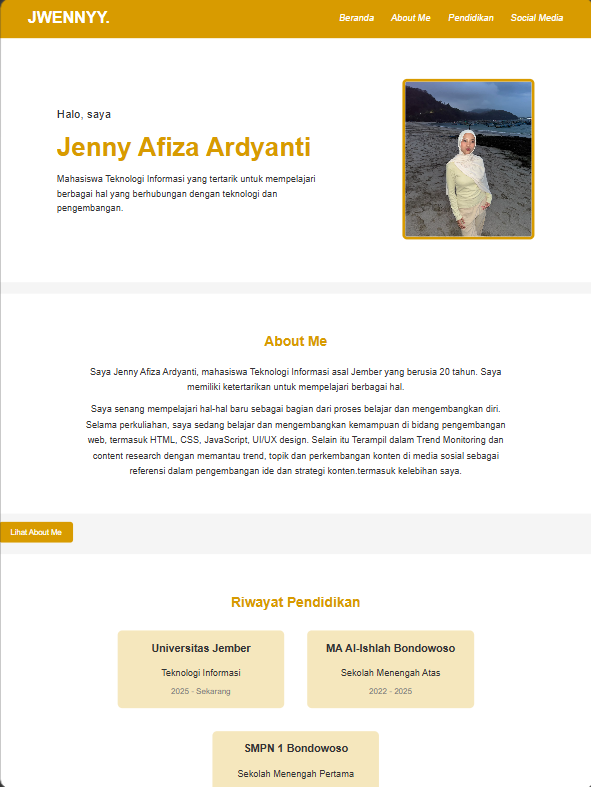
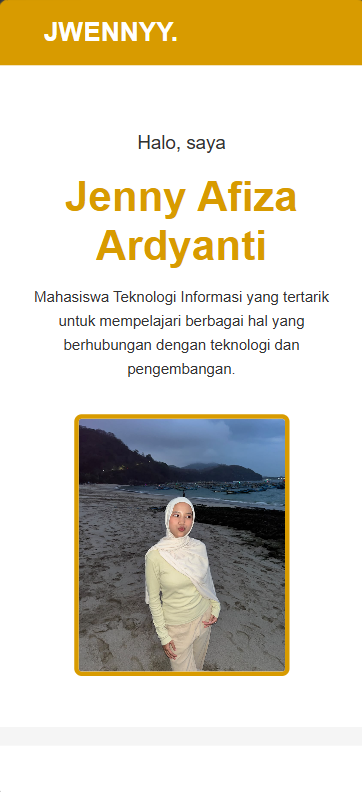

# Portfolio Website - Jenny Afiza

## Penjelasan Web

Website ini merupakan portfolio sederhana yang dibuat untuk memenuhi tugas Pemrograman Web (PWEB). Website ini berisi informasi singkat tentang diri saya, riwayat pendidikan, dan media sosial.

Website dibuat menggunakan HTML, Plain CSS, dan JavaScript DOM. Tampilan website juga dibuat responsive agar dapat menyesuaikan dengan ukuran layar desktop, tablet, dan mobile.

## Teknologi yang Digunakan

- HTML
- Plain CSS
- JavaScript (DOM)

Website tidak menggunakan framework seperti Bootstrap atau Tailwind CSS.

## Fitur

- Beranda
- About Me
- Riwayat Pendidikan
- Social Media
- Tombol "Lihat About Me"
- Navigasi menuju setiap section
- Responsive pada desktop, tablet, dan mobile

## Penerapan JavaScript DOM

JavaScript DOM digunakan untuk memberikan interaksi pada tombol "Lihat About Me". Ketika tombol diklik, halaman akan berpindah secara smooth menuju bagian About Me.

## Responsive

Website dibuat agar dapat menyesuaikan tampilan pada:

- Desktop
- Tablet
- Mobile

### Tampilan Desktop


### Tampilan Tablet



### Tampilan Mobile



## Struktur File

```text
jwennyy-portofolio/
- assets/
- jwenny.jpeg
- MOBILE.png
- screenshot.png
- TABLET&DEKSTOP.png
- index.html
- README.md
- script.js
- style.css